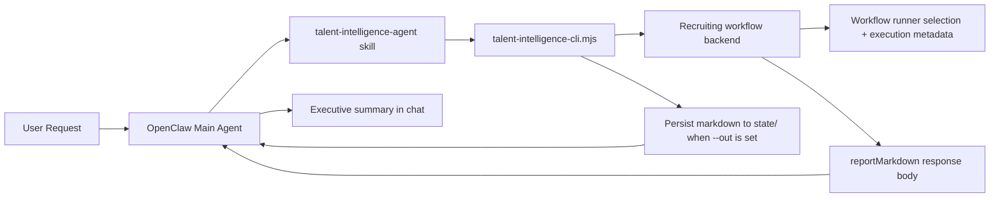

# Talent Intelligence Agent for OpenClaw

A recruiting and headhunting agent for OpenClaw that turns plain-language hiring requests into structured talent intelligence deliverables.

**Best for:** search consultants, in-house recruiters, recruiting operators, founders, and hiring managers.
**Best scenarios:** JD diagnosis, sourcing strategy, talent mapping, candidate assessment, hiring-plan design, and role calibration.

## Why this exists

Most assistants can brainstorm hiring advice in chat. Very few can reliably convert a fuzzy recruiting request into a reusable workflow that:
- routes to a dedicated talent-intelligence agent
- runs through a backend workflow runner boundary
- returns structured execution metadata alongside the report
- lets the caller persist the long-form output to disk without flooding the conversation

Talent Intelligence Agent is that layer.

## Core capabilities

- **Dedicated recruiting skill** for OpenClaw
- **Portable CLI wrapper** around a local recruiting workflow backend
- **Workflow-runner execution contract** with `run`, `engine`, `metadata`, `orchestration`, and persisted `artifacts` sections
- **Remote-integration aware execution catalog**: the backend publishes both `local-template` and `openai-chat`, and it can call the remote runner only when outbound calls are explicitly enabled and configured
- **Tightened runtime/error contract**: invalid runner ids, invalid runtime modes, missing required role titles, invalid JSON, and remote-required-but-unavailable requests now resolve through explicit error codes
- **Environment-variable based config** instead of machine-specific paths
- **Two-layer persistence model**: every HTTP run writes `request.json`, `response.json`, `report.md`, and `events.log` under `state/runs/YYYY/MM/DD/run_*`, while the CLI may additionally write a caller-selected markdown copy with `--out`
- **Packaged `.skill` artifact** for easy sharing
- **GitHub Actions packaging workflow** for distribution

## Repository layout

```text
projects/talent-intelligence-agent/
├── README.md
├── README.zh-CN.md
├── LICENSE
├── .gitignore
├── install.sh
├── examples/
│   ├── example.env
│   ├── executive-search-intake.json
│   ├── health-response.json
│   ├── schema-response.json
│   ├── run-request.json
│   ├── run-response.json
│   ├── error-invalid-template.json
│   ├── error-missing-role-title.json
│   └── error-invalid-json.json
├── .github/
│   └── workflows/
│       └── package-skill.yml
├── skill/
│   └── talent-intelligence-agent/
│       ├── SKILL.md
│       ├── scripts/
│       │   └── talent-intelligence-cli.mjs
│       └── references/
│           ├── intake-fields.md
│           ├── scoring-rubric.md
│           └── templates.md
└── dist/
    └── talent-intelligence-agent.skill
```

## Architecture



## Requirements

- OpenClaw
- Node.js 18+
- **Recruiting workflow backend** — running and reachable
- Optional backend remote-runner env vars (`TALENT_INTEL_REMOTE_*`, `TALENT_INTEL_ENABLE_REMOTE_RUNNER`) if you want the server to actually call an OpenAI-compatible endpoint
- Optional CLI convenience env vars (`TALENT_INTEL_LLM_*`) for the bundled wrapper, which are forwarded into request runtime fields

## Quick start

### 0) Run the local demo

If you want to validate the end-to-end wiring before building a real backend:

```bash
bash demo/run-demo.sh
```

This starts the local backend service, runs five example workflows through the local workflow runner, and writes markdown reports into `state/` via the CLI.


### 1) Configure runtime endpoints

```bash
export TALENT_INTEL_BACKEND_URL="http://<your-host>:<your-port>"

# CLI-side convenience vars used by talent-intelligence-cli.mjs
export TALENT_INTEL_LLM_BASE_URL="http://<your-llm-proxy>:<port>/v1"
export TALENT_INTEL_LLM_API_KEY="<your-api-key>"
export TALENT_INTEL_DEFAULT_MODEL="bailian/qwen3.5-plus"

# Server-side remote runner vars used by server/app/remote-openai.mjs
export TALENT_INTEL_ENABLE_REMOTE_RUNNER="1"
export TALENT_INTEL_REMOTE_BASE_URL="http://<your-llm-proxy>:<port>/v1"
export TALENT_INTEL_REMOTE_API_KEY="<your-api-key>"
# optional
export TALENT_INTEL_REMOTE_PATH="/chat/completions"
export TALENT_INTEL_REMOTE_ORG="<your-org>"
export TALENT_INTEL_REMOTE_PROJECT="<your-project>"
```

Optional tuning:

```bash
export TALENT_INTEL_TEMPERATURE="0.4"
export TALENT_INTEL_MAX_TOKENS="5000"
export TALENT_INTEL_TIMEOUT_MS="120000"
```

### 2) Install the skill

Option A: copy the skill directly.

```bash
cp -R skill/talent-intelligence-agent ~/.openclaw/workspace/skills/
```

Option B: use the helper installer.

```bash
bash install.sh ~/.openclaw/workspace
```

## Usage in OpenClaw

Ask for things like:
- "Analyze this JD and tell me why it is hard to fill"
- "Build a sourcing strategy for a VP of Sales in Shanghai"
- "Evaluate this candidate against the role"
- "Map target companies for an AI product lead search"

Expected behavior:
1. The skill converts the request into a structured brief.
2. The CLI calls the backend run endpoint.
3. The backend resolves the requested mode/runner through the execution catalog; if `openai-chat` is requested but outbound remote calls are not both enabled and configured, the request falls back to `local-template`.
4. The backend returns `reportMarkdown`, workflow-runner metadata (`run`, `engine`, `metadata`, `orchestration`), and persisted run-artifact paths in `artifacts`.
5. If `--out` is set, the CLI also writes a caller-chosen markdown file to `state/`.
6. Chat returns an executive summary, key risks, and the file path.

## CLI example

```bash
node skill/talent-intelligence-agent/scripts/talent-intelligence-cli.mjs \
  --projectName "Confidential Client - VP Product Search" \
  --roleTitle "VP Product" \
  --clientName "Confidential Client" \
  --searchType executive_search \
  --mandateType retained \
  --companyContext "Series C AI infra company selling to enterprise customers" \
  --hiringBrief "Find a product leader who can unify platform roadmap and enterprise customer requirements" \
  --objective "Output search strategy and target-company map" \
  --reportingLine "CEO" \
  --level VP \
  --targetIndustry "Enterprise software, cloud, AI infrastructure" \
  --targetCompanies "Huawei Cloud, Alibaba Cloud, Volcano Engine, Tencent Cloud" \
  --targetFunctions "Enterprise product, Platform product, Solution product" \
  --targetBackgrounds "0-1 to 1-10, 20+ PM org, enterprise sales collaboration" \
  --mustHaveSkills "Enterprise product leadership, large-customer collaboration, people leadership" \
  --offLimits "Portfolio company A, board-controlled asset B" \
  --location "Shanghai" \
  --salaryRange "Base 150-220k RMB/month" \
  --templateId sourcing_strategy_cn \
  --out ../../state/vp-product-search.md
```

## Intake-file example

Instead of passing a long list of flags, you can load a full executive-search brief from JSON:

```bash
node skill/talent-intelligence-agent/scripts/talent-intelligence-cli.mjs \
  --intakeFile examples/executive-search-intake.json \
  --out state/demo-executive-search.md
```

CLI flags override values from `--intakeFile`, so the file works well as a reusable base brief.
A non-empty `roleTitle` is required either from CLI flags or from the intake JSON.

## Template guide

- `jd_diagnosis_cn`: role diagnosis, requirement tuning, hiring difficulty analysis
- `sourcing_strategy_cn`: target company mapping, channel strategy, keyword and Boolean search design
- `candidate_assessment_cn`: resume review, fit analysis, risk flags, interview follow-ups
- `search_plan_cn`: broader recruiting plan, weekly priorities, advisory recommendations

## Demo output files

After `bash demo/run-demo.sh`, you should see:

- `state/demo-sourcing-strategy.md`
- `state/demo-jd-diagnosis.md`
- `state/demo-candidate-assessment.md`
- `state/demo-search-plan.md`
- `state/demo-executive-search.md`

The last two files validate the broader executive-search intake flow and `--intakeFile` support.

## Local backend service

Start the local service skeleton:

```bash
node server/index.mjs
```

Service docs:
- `server/README.md`
- `server/API.md`

Canonical HTTP example payloads:
- `examples/health-response.json`
- `examples/schema-response.json`
- `examples/run-request.json`
- `examples/run-response.json`
- `examples/error-invalid-template.json`
- `examples/error-missing-role-title.json`
- `examples/error-invalid-json.json`

The current implementation keeps a stable HTTP contract while using a local workflow runner with a template-render step under the hood. It also includes a real remote-runner harness for OpenAI-compatible chat completions in `server/app/remote-openai.mjs`, but outbound calls only happen when the remote runner is explicitly enabled and configured; otherwise requests that target `openai-chat` fall back to `local-template`. The HTTP service persists per-run artifacts under `state/runs/...` automatically, while the CLI can additionally write a caller-selected markdown file with `--out`.

## Notes for backend implementers

Current contract highlights:

- Health endpoint: `GET /health`
- Schema endpoint: `GET /api/talent-intelligence/schema`
- Run endpoint: `POST /api/talent-intelligence/run`
- Supported templates: `jd_diagnosis_cn`, `sourcing_strategy_cn`, `candidate_assessment_cn`, `search_plan_cn`
- Health and schema responses expose the execution catalog, including `defaultPublicMode`, executable runner ids, and planned runner ids
- Success responses include workflow-runner metadata in `run`, `engine`, `metadata`, and `orchestration`, plus persisted file locations in `artifacts`
- `reportMarkdown` is returned inline; the server also persists run artifacts automatically under `state/runs/...`, while CLI `--out` remains a separate caller-controlled write
- Error responses use `metadata.status` instead of a top-level `status` field
- The server accepts either nested `searchContext` or a flat top-level brief, then normalizes to the same internal shape
- `searchContext.roleTitle` is required after trimming; missing or whitespace-only values return `MISSING_ROLE_TITLE`
- Invalid runner aliases return `INVALID_RUNNER`; unsupported runtime modes return `INVALID_RUNTIME_MODE`
- If `runtime.remoteRequired=true` and the remote runner is not callable, the server returns `REMOTE_RUNNER_REQUIRED_BUT_UNAVAILABLE` instead of silently falling back

Reference docs and canonical examples:

- `server/API.md`
- `examples/health-response.json`
- `examples/schema-response.json`
- `examples/run-request.json`
- `examples/run-response.json`
- `examples/error-invalid-template.json`
- `examples/error-missing-role-title.json`
- `examples/error-invalid-json.json`

The bundled CLI still includes a fallback markdown generator for backend failures. The bundled HTTP backend can now exercise the remote adapter against a local mock OpenAI-compatible provider, so you can integration-test the remote path without external internet.

Offline remote-harness smoke test:

```bash
bash demo/test-remote-harness.sh
```

That script starts `server/mock-openai-provider.mjs` on a local port, starts the backend with `TALENT_INTEL_ENABLE_REMOTE_RUNNER=1`, submits `examples/run-request-remote-mock.json`, and asserts that the response stayed on runner `openai-chat` without fallback.

## License

MIT
