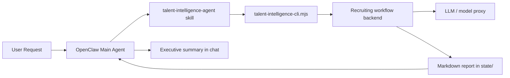

# Talent Intelligence Agent for OpenClaw

A recruiting and headhunting agent for OpenClaw that turns plain-language hiring requests into structured talent intelligence deliverables.

**Best for:** search consultants, in-house recruiters, recruiting operators, founders, and hiring managers.
**Best scenarios:** JD diagnosis, sourcing strategy, talent mapping, candidate assessment, hiring-plan design, and role calibration.

## Why this exists

Most assistants can brainstorm hiring advice in chat. Very few can reliably convert a fuzzy recruiting request into a reusable workflow that:
- routes to a dedicated talent-intelligence agent
- runs through a backend workflow engine
- saves long-form output to disk
- returns a clean executive summary instead of flooding the conversation

Talent Intelligence Agent is that layer.

## Core capabilities

- **Dedicated recruiting skill** for OpenClaw
- **Portable CLI wrapper** around a local recruiting workflow backend
- **Environment-variable based config** instead of machine-specific paths
- **Long report to `state/`** and short answer in chat
- **Packaged `.skill` artifact** for easy sharing
- **GitHub Actions packaging workflow** for distribution

## Repository layout

```text
projects/talent-intelligence-agent/
├── README.md
├── README.zh-CN.md
├── LICENSE
├── .gitignore
├── install.sh
├── examples/
│   └── example.env
├── .github/
│   └── workflows/
│       └── package-skill.yml
├── skill/
│   └── talent-intelligence-agent/
│       ├── SKILL.md
│       ├── scripts/
│       │   └── talent-intelligence-cli.mjs
│       └── references/
│           ├── intake-fields.md
│           ├── scoring-rubric.md
│           └── templates.md
└── dist/
    └── talent-intelligence-agent.skill
```

## Architecture



## Requirements

- OpenClaw
- Node.js 18+
- **Recruiting workflow backend** — running and reachable
- **LLM proxy** (OpenAI-compatible endpoint)

## Quick start

### 0) Run the local demo

If you want to validate the end-to-end wiring before building a real backend:

```bash
bash demo/run-demo.sh
```

This starts the mock backend, runs four example workflows, and writes markdown reports into `state/`.


### 1) Configure runtime endpoints

```bash
export TALENT_INTEL_BACKEND_URL="http://<your-host>:<your-port>"
export TALENT_INTEL_LLM_BASE_URL="http://<your-llm-proxy>:<port>/v1"
export TALENT_INTEL_LLM_API_KEY="<your-api-key>"
export TALENT_INTEL_DEFAULT_MODEL="bailian/qwen3.5-plus"
```

Optional tuning:

```bash
export TALENT_INTEL_TEMPERATURE="0.4"
export TALENT_INTEL_MAX_TOKENS="5000"
export TALENT_INTEL_TIMEOUT_MS="120000"
```

### 2) Install the skill

Option A: copy the skill directly.

```bash
cp -R skill/talent-intelligence-agent ~/.openclaw/workspace/skills/
```

Option B: use the helper installer.

```bash
bash install.sh ~/.openclaw/workspace
```

## Usage in OpenClaw

Ask for things like:
- "Analyze this JD and tell me why it is hard to fill"
- "Build a sourcing strategy for a VP of Sales in Shanghai"
- "Evaluate this candidate against the role"
- "Map target companies for an AI product lead search"

Expected behavior:
1. The skill converts the request into a structured brief.
2. The CLI calls the backend.
3. A long markdown report is saved to `state/`.
4. Chat returns an executive summary, key risks, and the file path.

## CLI example

```bash
node skill/talent-intelligence-agent/scripts/talent-intelligence-cli.mjs \
  --projectName "Confidential Client - VP Product Search" \
  --roleTitle "VP Product" \
  --clientName "Confidential Client" \
  --searchType executive_search \
  --mandateType retained \
  --companyContext "Series C AI infra company selling to enterprise customers" \
  --hiringBrief "Find a product leader who can unify platform roadmap and enterprise customer requirements" \
  --objective "Output search strategy and target-company map" \
  --reportingLine "CEO" \
  --level VP \
  --targetIndustry "Enterprise software, cloud, AI infrastructure" \
  --targetCompanies "Huawei Cloud, Alibaba Cloud, Volcano Engine, Tencent Cloud" \
  --targetFunctions "Enterprise product, Platform product, Solution product" \
  --targetBackgrounds "0-1 to 1-10, 20+ PM org, enterprise sales collaboration" \
  --mustHaveSkills "Enterprise product leadership, large-customer collaboration, people leadership" \
  --offLimits "Portfolio company A, board-controlled asset B" \
  --location "Shanghai" \
  --salaryRange "Base 150-220k RMB/month" \
  --templateId sourcing_strategy_cn \
  --out ../../state/vp-product-search.md
```

## Intake-file example

Instead of passing a long list of flags, you can load a full executive-search brief from JSON:

```bash
node skill/talent-intelligence-agent/scripts/talent-intelligence-cli.mjs \
  --intakeFile examples/executive-search-intake.json \
  --out state/demo-executive-search.md
```

CLI flags override values from `--intakeFile`, so the file works well as a reusable base brief.

## Template guide

- `jd_diagnosis_cn`: role diagnosis, requirement tuning, hiring difficulty analysis
- `sourcing_strategy_cn`: target company mapping, channel strategy, keyword and Boolean search design
- `candidate_assessment_cn`: resume review, fit analysis, risk flags, interview follow-ups
- `search_plan_cn`: broader recruiting plan, weekly priorities, advisory recommendations

## Demo output files

After `bash demo/run-demo.sh`, you should see:

- `state/demo-sourcing-strategy.md`
- `state/demo-jd-diagnosis.md`
- `state/demo-candidate-assessment.md`
- `state/demo-search-plan.md`
- `state/demo-executive-search.md`

The last two files validate the broader executive-search intake flow and `--intakeFile` support.

## Notes for backend implementers

Recommended API shape:

```json
POST /api/talent-intelligence/run
{
  "searchContext": {
    "projectName": "AI Product Director Search",
    "roleTitle": "AI Product Director",
    "companyContext": "Series B AI SaaS company",
    "hiringBrief": "Clarify target profile and produce a sourcing strategy",
    "objective": "Output search strategy and target-company map",
    "targetIndustry": "Enterprise software, AI SaaS",
    "targetCompanies": ["OpenAI", "ByteDance"],
    "location": "Shanghai",
    "salaryRange": "80-120K RMB/month"
  },
  "templateId": "sourcing_strategy_cn",
  "runtime": {
    "mode": "openai",
    "baseUrl": "http://127.0.0.1:8999/v1",
    "apiKey": "test-key",
    "model": "bailian/qwen3.5-plus"
  }
}
```

The bundled CLI currently includes a fallback markdown generator so the wiring can be tested before the real backend is ready.

## License

MIT
