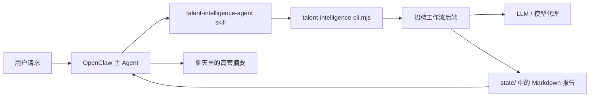

# Talent Intelligence Agent for OpenClaw

一个面向 OpenClaw 的招聘 / 猎头 Agent，用来把自然语言招聘需求稳定地转成结构化人才情报交付物。

**最适合的人群：** 猎头顾问、企业招聘、招聘运营、创始人、业务负责人。
**最适合的场景：** JD 诊断、寻访策略、人才地图、候选人评估、招聘计划设计、岗位校准。

## 这个项目解决什么问题

大多数 AI 助手都能在聊天里给一点招聘建议。
但很少有方案能把模糊招聘需求真正变成一条可复用工作流，并且同时满足：

- 路由到一个独立人才情报 Agent
- 调用后端工作流引擎
- 把长报告落盘保存
- 聊天里只回高管摘要，而不是刷屏

Talent Intelligence Agent 就是这一层。

## 核心能力

- **OpenClaw 独立招聘 Skill**
- **本地招聘工作流后端的可移植 CLI 包装层**
- **基于环境变量配置**，不依赖机器私有路径
- **完整报告写入 `state/`**，对话只保留摘要
- **支持打包成 `.skill` 分发**
- **自带 GitHub Actions 打包流程**

## 仓库结构

```text
projects/talent-intelligence-agent/
├── README.md
├── README.zh-CN.md
├── LICENSE
├── .gitignore
├── install.sh
├── examples/
│   └── example.env
├── .github/
│   └── workflows/
│       └── package-skill.yml
├── skill/
│   └── talent-intelligence-agent/
│       ├── SKILL.md
│       ├── scripts/
│       │   └── talent-intelligence-cli.mjs
│       └── references/
│           ├── intake-fields.md
│           ├── scoring-rubric.md
│           └── templates.md
└── dist/
    └── talent-intelligence-agent.skill
```

## 架构图



## 依赖

- OpenClaw
- Node.js 18+
- **招聘工作流后端** — 需运行中且可访问
- **LLM 代理**（OpenAI-compatible 模型端点）

## 快速开始

### 0）先跑本地 demo

如果你想先验证整条链路，而不是马上接真实后端：

```bash
bash demo/run-demo.sh
```

这会启动 mock backend，跑三组示例任务，并把 markdown 报告写入 `state/`。


### 1）配置运行时环境变量

```bash
export TALENT_INTEL_BACKEND_URL="http://<your-host>:<your-port>"
export TALENT_INTEL_LLM_BASE_URL="http://<your-llm-proxy>:<port>/v1"
export TALENT_INTEL_LLM_API_KEY="<your-api-key>"
export TALENT_INTEL_DEFAULT_MODEL="bailian/qwen3.5-plus"
```

可选调优：

```bash
export TALENT_INTEL_TEMPERATURE="0.4"
export TALENT_INTEL_MAX_TOKENS="5000"
export TALENT_INTEL_TIMEOUT_MS="120000"
```

### 2）安装 skill

方式一：直接复制。

```bash
cp -R skill/talent-intelligence-agent ~/.openclaw/workspace/skills/
```

方式二：运行安装脚本。

```bash
bash install.sh ~/.openclaw/workspace
```

## 在 OpenClaw 中怎么用

你可以直接说：
- “分析这个 JD，告诉我为什么难招”
- “给上海的销售 VP 做一个寻访策略”
- “评估这个候选人和岗位的匹配度”
- “给 AI 产品负责人岗位做目标公司地图”

预期行为：
1. Skill 把请求整理成结构化 brief
2. CLI 调用后端
3. 长 Markdown 报告保存到 `state/`
4. 聊天里只返回摘要、风险提醒和文件路径

## CLI 调用示例

```bash
node skill/talent-intelligence-agent/scripts/talent-intelligence-cli.mjs \
  --projectName "AI 产品总监寻访" \
  --roleTitle "AI 产品总监" \
  --companyContext "一家做企业级 AI 工具的 B 轮 SaaS 公司" \
  --hiringBrief "明确目标画像并输出寻访策略" \
  --objective "产出搜寻策略与目标公司地图" \
  --targetIndustry "企业软件, AI SaaS" \
  --targetCompanies "OpenAI, ByteDance, Baidu, MiniMax" \
  --location "上海" \
  --salaryRange "月薪 8-12 万" \
  --templateId sourcing_strategy_cn \
  --out ../../state/ai-product-director-search.md
```

## 模板说明

- `jd_diagnosis_cn`：岗位诊断、要求调优、招聘难度分析
- `sourcing_strategy_cn`：目标公司地图、渠道策略、关键词与布尔搜索设计
- `candidate_assessment_cn`：简历评估、匹配分析、风险提示、面试追问
- `search_plan_cn`：更完整的招聘计划、周优先级、顾问式建议

## 给后端实现者的建议

推荐接口形态：

```json
POST /api/talent-intelligence/run
{
  "searchContext": {
    "projectName": "AI 产品总监寻访",
    "roleTitle": "AI 产品总监",
    "companyContext": "一家 B 轮 AI SaaS 公司",
    "hiringBrief": "明确目标画像并输出寻访策略",
    "objective": "产出搜寻策略与目标公司地图",
    "targetIndustry": "企业软件, AI SaaS",
    "targetCompanies": ["OpenAI", "ByteDance"],
    "location": "上海",
    "salaryRange": "月薪 8-12 万"
  },
  "templateId": "sourcing_strategy_cn",
  "runtime": {
    "mode": "openai",
    "baseUrl": "http://127.0.0.1:8999/v1",
    "apiKey": "test-key",
    "model": "bailian/qwen3.5-plus"
  }
}
```

当前自带的 CLI 已经内置 fallback markdown 生成逻辑，所以即使真实后端还没接好，也可以先验证链路。

## License

MIT
