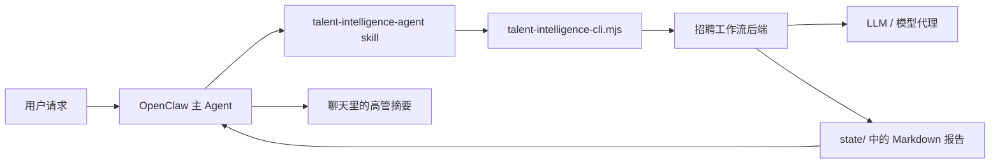

# Talent Intelligence Agent for OpenClaw

一个面向 OpenClaw 的招聘 / 猎头 Agent，用来把自然语言招聘需求稳定地转成结构化人才情报交付物。

**最适合的人群：** 猎头顾问、企业招聘、招聘运营、创始人、业务负责人。
**最适合的场景：** JD 诊断、寻访策略、人才地图、候选人评估、招聘计划设计、岗位校准。

## 这个项目解决什么问题

大多数 AI 助手都能在聊天里给一点招聘建议。
但很少有方案能把模糊招聘需求真正变成一条可复用工作流，并且同时满足：

- 路由到一个独立人才情报 Agent
- 调用后端工作流引擎
- 把长报告落盘保存
- 聊天里只回高管摘要，而不是刷屏

Talent Intelligence Agent 就是这一层。

## 核心能力

- **v0.11 可信评估**：候选人评估现在返回以证据为中心的结构化结果，使评分标准、证据和置信度显式化，便于本地验证和下游消费。
- **批量候选人评估支持 (v0.9)**：支持在单次请求中评估多个候选人，通过 `context.candidates` 数组传递
- **OpenClaw 独立招聘 Skill**
- **本地招聘工作流后端的可移植 CLI 包装层**
- **基于环境变量配置**，不依赖机器私有路径
- **完整报告写入 `state/`**，对话只保留摘要
- **支持打包成 `.skill` 分发**
- **自带 GitHub Actions 打包流程**
- **向后兼容**：v0.9 完全兼容现有的单候选人工作流，同时增加多候选人支持

## 仓库结构

```text
projects/talent-intelligence-agent/
├── README.md
├── README.zh-CN.md
├── LICENSE
├── .gitignore
├── install.sh
├── examples/
│   ├── example.env
│   ├── executive-search-intake.json
│   ├── run-request.json
│   ├── run-response.json
│   ├── error-invalid-template.json
│   └── error-invalid-json.json
├── .github/
│   └── workflows/
│       └── package-skill.yml
├── skill/
│   └── talent-intelligence-agent/
│       ├── SKILL.md
│       ├── scripts/
│       │   └── talent-intelligence-cli.mjs
│       └── references/
│           ├── intake-fields.md
│           ├── scoring-rubric.md
│           └── templates.md
└── dist/
    └── talent-intelligence-agent.skill
```

## 架构图



## 依赖

- OpenClaw
- Node.js 18+
- **招聘工作流后端** — 需运行中且可访问
- **LLM 代理**（OpenAI-compatible 模型端点）

## 快速开始

### 0）先跑本地 demo

如果你想先验证整条链路，而不是马上接真实后端：

```bash
bash demo/run-demo.sh
```

这会启动本地 backend service，跑五组示例任务，并把 markdown 报告写入 `state/`。


### 1）配置运行时环境变量

```bash
export TALENT_INTEL_BACKEND_URL="http://<your-host>:<your-port>"
export TALENT_INTEL_LLM_BASE_URL="http://<your-llm-proxy>:<port>/v1"
export TALENT_INTEL_LLM_API_KEY="<your-api-key>"
export TALENT_INTEL_DEFAULT_MODEL="bailian/qwen3.5-plus"
```

可选调优：

```bash
export TALENT_INTEL_TEMPERATURE="0.4"
export TALENT_INTEL_MAX_TOKENS="5000"
export TALENT_INTEL_TIMEOUT_MS="120000"
```

### 2）安装 skill

方式一：直接复制。

```bash
cp -R skill/talent-intelligence-agent ~/.openclaw/workspace/skills/
```

方式二：运行安装脚本。

```bash
bash install.sh ~/.openclaw/workspace
```

## 在 OpenClaw 中怎么用

你可以直接说：
- “分析这个 JD，告诉我为什么难招”
- “给上海的销售 VP 做一个寻访策略”
- “评估这个候选人和岗位的匹配度”
- “给 AI 产品负责人岗位做目标公司地图”

预期行为：
1. Skill 把请求整理成结构化 brief
2. CLI 调用后端
3. 长 Markdown 报告保存到 `state/`
4. 聊天里只返回摘要、风险提醒和文件路径

## CLI 调用示例

```bash
node skill/talent-intelligence-agent/scripts/talent-intelligence-cli.mjs \
  --projectName "Confidential Client - VP Product Search" \
  --roleTitle "VP Product" \
  --clientName "Confidential Client" \
  --searchType executive_search \
  --mandateType retained \
  --companyContext "一家面向企业客户的 Series C AI infra 公司" \
  --hiringBrief "寻找能统一平台路线图与大客户需求的产品负责人" \
  --objective "产出寻访策略与目标公司地图" \
  --reportingLine "CEO" \
  --level VP \
  --targetIndustry "企业软件, 云计算, AI infrastructure" \
  --targetCompanies "Huawei Cloud, Alibaba Cloud, Volcano Engine, Tencent Cloud" \
  --targetFunctions "企业产品, 平台产品, 解决方案产品" \
  --targetBackgrounds "0-1 到 1-10, 带过 20+ PM 团队, 和销售深度协同" \
  --mustHaveSkills "企业产品领导力, 大客户协同, 团队管理" \
  --offLimits "现有投资组合公司 A, 董事会控制资产 B" \
  --location "上海" \
  --salaryRange "月 base 15-22 万" \
  --templateId sourcing_strategy_cn \
  --out ../../state/vp-product-search.md
```

## `--intakeFile` 示例

如果不想手动传一长串参数，可以直接加载完整委托单 JSON：

```bash
node skill/talent-intelligence-agent/scripts/talent-intelligence-cli.mjs \
  --intakeFile examples/executive-search-intake.json \
  --out state/demo-executive-search.md
```

CLI 显式传入的参数会覆盖 `--intakeFile` 中的同名字段，所以很适合把 JSON 当基础 brief 复用。
无论哪种方式，`roleTitle` 都必须提供非空值。

## 模板说明

- `jd_diagnosis_cn`：岗位诊断、要求调优、招聘难度分析
- `sourcing_strategy_cn`：目标公司地图、渠道策略、关键词与布尔搜索设计
- `candidate_assessment_cn`：简历评估、匹配分析、风险提示、面试追问
- `search_plan_cn`：更完整的招聘计划、周优先级、顾问式建议

## Demo 产物文件

运行 `bash demo/run-demo.sh` 后，应该看到：

- `state/demo-sourcing-strategy.md`
- `state/demo-jd-diagnosis.md`
- `state/demo-candidate-assessment.md`
- `state/demo-search-plan.md`
- `state/demo-executive-search.md`

最后两个文件分别验证更完整的 executive-search intake 流程，以及 `--intakeFile` 的本地可用性。

## 本地 backend service

启动本地服务骨架：

```bash
node server/index.mjs
```

服务文档：
- `server/README.md`
- `server/API.md`

标准 HTTP 示例文件：
- `examples/run-request.json`
- `examples/run-response.json`
- `examples/error-invalid-template.json`
- `examples/error-invalid-json.json`

当前实现已经把 HTTP 接口层、schema 层、service 层、template 层拆开了。后面你可以直接替换 `server/app/service.mjs` 为真实 workflow engine，而不用推翻 CLI 契约。

## 给后端实现者的说明

当前接口契约重点：

- 健康检查：`GET /health`
- schema：`GET /api/talent-intelligence/schema`
- 执行入口：`POST /api/talent-intelligence/run`
- 支持模板：`jd_diagnosis_cn`、`sourcing_strategy_cn`、`candidate_assessment_cn`、`search_plan_cn`
- 错误响应目前会在 JSON 顶层附带 `status` 字段
- 服务端既接受嵌套的 `searchContext`，也接受平铺 top-level brief，随后统一归一化

参考文档和标准示例：

- `server/API.md`
- `examples/run-request.json`
- `examples/run-response.json`
- `examples/error-invalid-template.json`
- `examples/error-invalid-json.json`

当前自带的 CLI 已经内置 fallback markdown 生成逻辑，所以即使真实后端还没接好，也可以先验证链路。

## License

MIT
